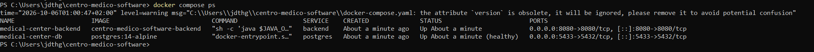
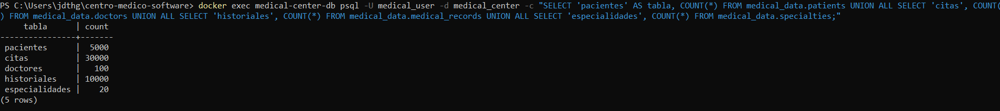
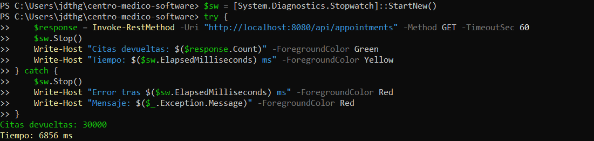
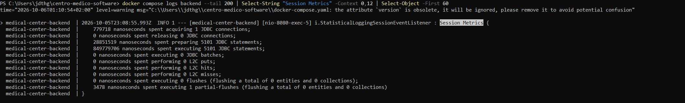

# 🏥 Reto 4 — Optimización de consultas en Hibernate


> **Reto 4 del curso Código Samurái** — Análisis y optimización de consultas
> Hibernate en una API REST de gestión médica.

---

## 📖 Índice

1. [El problema](#-el-problema)
2. [Análisis inicial (baseline)](#-análisis-inicial-baseline)
3. [Optimización 1: Índices de BD](#-optimización-1-índices-de-bd)
4. [Optimización 2: JOIN FETCH + @BatchSize](#-optimización-2-join-fetch--batchsize)
5. [Optimización 3: Paginación](#-optimización-3-paginación)
6. [Resultados finales](#-resultados-finales)
7. [Lecciones aprendidas](#-lecciones-aprendidas)
8. [Cómo ejecutar](#-cómo-ejecutar)

---

## 🎯 El problema

Partimos de una API REST de gestión médica (pacientes, doctores, citas)
construida con **Spring Boot 3.2 + Hibernate 6.4 + PostgreSQL 14**.

La base de datos contiene:

| Tabla | Registros |
|---|---|
| `medical_data.patients` | 5.000 |
| `medical_data.appointments` | 30.000 |
| `medical_data.doctors` | 100 |
| `medical_data.medical_records` | 10.000 |
| `medical_data.specialties` | 20 |

Los endpoints de listado tenían **tiempos de respuesta inaceptables**
y el objetivo del reto era **reducirlos drásticamente**.

---

## 🔬 Análisis inicial (baseline)

### 1. Medición de tiempos

Antes de tocar nada, medimos los endpoints principales:

| Endpoint | Filas | Tiempo |
|---|---|---|
| `GET /api/doctors` | 100 | **1.823 ms** |
| `GET /api/patients` | 5.000 | **2.120 ms** |
| `GET /api/appointments` | 30.000 | **6.856 ms** ⚠️ |

📸 **Estado inicial de los contenedores**:



📸 **Datos cargados en PostgreSQL**:



📸 **Endpoint `/api/appointments` tardando 6.856 ms**:



### 2. Hibernate Statistics: el diagnóstico

Activamos `hibernate.generate_statistics=true` y esta fue la sorpresa:
Session Metrics {
779.718 ns spent acquiring 1 JDBC connection
28.851.519 ns spent preparing 5.101 JDBC statements ← ¡5.101 queries!
849.779.706 ns spent executing 5.101 JDBC statements
}

text

**Una sola petición a `/api/appointments` lanzaba 5.101 queries.** Eso es el
**problema N+1** en su máxima expresión.

📸 **Hibernate Statistics del baseline**:



### 3. ¿Por qué 5.101 queries?

El código original tenía **`FetchType.EAGER`** en las relaciones:

```java
// Appointment.java — CÓDIGO ORIGINAL
@ManyToOne(fetch = FetchType.EAGER)   // ← PROBLEMA
@JoinColumn(name = "patient_id")
private Patient patient;

@ManyToOne(fetch = FetchType.EAGER)   // ← PROBLEMA
@JoinColumn(name = "doctor_id")
private Doctor doctor;
Con 30.000 citas, Hibernate hacía:

1 query para traer las citas

N queries para cada paciente

N queries para cada doctor

N queries para cada especialidad del doctor

Resultado: miles de queries pequeñas.

4. EXPLAIN ANALYZE: los índices brillan por su ausencia
Comprobamos el plan de ejecución de las queries más comunes:

Query 1: buscar paciente por documento

sql
EXPLAIN ANALYZE SELECT * FROM medical_data.patients
WHERE document_number = 'DOC00000001';
text
Seq Scan on patients  (cost=0.00..180.50 rows=1)
  Filter: ((document_number)::text = 'DOC00000001'::text)
  Rows Removed by Filter: 4999      ← recorre 5000 filas para encontrar 1
  Execution Time: 0.532 ms
Query 2: citas por fecha

sql
EXPLAIN ANALYZE SELECT * FROM medical_data.appointments
WHERE appointment_date > '2024-01-01' ORDER BY appointment_date LIMIT 100;
text
Seq Scan on appointments
  Rows Removed by Filter: 15035
  Execution Time: 2.557 ms
Query 3: citas por doctor

sql
EXPLAIN ANALYZE SELECT * FROM medical_data.appointments
WHERE doctor_id = 5;
text
Seq Scan on appointments
  Rows Removed by Filter: 29700      ← recorre 30000 filas para encontrar 300
  Execution Time: 1.290 ms
📸 EXPLAIN ANALYZE del baseline (todos Seq Scan):

https://docs/capturas/01_fase_inicial_ANTES/08_explain_analyze_ANTES.png

5. Problemas identificados
#	Problema	Impacto
1	N+1 queries por FetchType.EAGER	5.101 queries por petición
2	Falta de índices en columnas filtradas	Full table scans
3	Sin paginación en endpoints masivos	Respuestas de 30.000 filas
4	Sin caché L2 en catálogos	Releídas constantemente
5	Referencia circular JSON	StackOverflowError
🚀 Optimización 1: Índices de BD
¿Qué hicimos?
Creamos una nueva migración Flyway (V3__add_indexes.sql) con 24 índices:

sql
-- medical_data.patients
CREATE INDEX idx_patients_document_number ON medical_data.patients (document_number);
CREATE INDEX idx_patients_email           ON medical_data.patients (email);
CREATE INDEX idx_patients_last_name       ON medical_data.patients (last_name);
CREATE INDEX idx_patients_first_name_lower ON medical_data.patients (LOWER(first_name));

-- medical_data.doctors
CREATE INDEX idx_doctors_specialty_id     ON medical_data.doctors (specialty_id);

-- medical_data.appointments
CREATE INDEX idx_appointments_patient_id  ON medical_data.appointments (patient_id);
CREATE INDEX idx_appointments_doctor_id   ON medical_data.appointments (doctor_id);
CREATE INDEX idx_appointments_date        ON medical_data.appointments (appointment_date);
CREATE INDEX idx_appointments_status_date ON medical_data.appointments (status, appointment_date);

-- ... y 15 más
Resultado: Seq Scan → Index Scan
Query 1: buscar por documento

sql
EXPLAIN ANALYZE SELECT * FROM medical_data.patients
WHERE document_number = 'DOC00000001';
text
Index Scan using idx_patients_document_number on patients
  Index Cond: ((document_number)::text = 'DOC00000001'::text)
  Execution Time: 0.076 ms      ← 7x más rápido (antes 0.532 ms)
Query 2: citas por fecha

text
Index Scan using idx_appointments_date on appointments
  Index Cond: (appointment_date > '2024-01-01 00:00:00+00')
  Execution Time: 0.195 ms      ← 13x más rápido (antes 2.557 ms)
Query 3: citas por doctor

text
Bitmap Index Scan on idx_appointments_doctor_id
  Index Cond: (doctor_id = 5)
  Execution Time: 0.443 ms      ← 3x más rápido (antes 1.290 ms)
📸 EXPLAIN ANALYZE optimizado (con Index Scan):

https://docs/capturas/02_optimizaciones/10a_explain_analyze_DESPUES_indices.png

📸 Comparativa antes vs después:

https://docs/capturas/02_optimizaciones/10b_comparativa_ANTES_vs_DESPUES_indices.png

Impacto
Query	Antes	Después	Mejora
WHERE document_number	0.532 ms	0.076 ms	7x
WHERE appointment_date	2.557 ms	0.195 ms	13x
WHERE doctor_id	1.290 ms	0.443 ms	3x
🚀 Optimización 2: JOIN FETCH + @BatchSize
El problema: N+1
Con FetchType.EAGER, Hibernate hacía una query por cada relación. Con
30.000 citas eso eran 5.101 queries por petición.

La solución: JOIN FETCH
Modificamos AppointmentRepository para cargar todo en una sola query:

java
// AppointmentRepository.java — DESPUÉS
@Query("SELECT a FROM Appointment a " +
       "JOIN FETCH a.patient p " +
       "JOIN FETCH a.doctor d " +
       "JOIN FETCH d.specialty s")
List<Appointment> findAllWithDetails();
📸 Código con JOIN FETCH:

https://docs/capturas/02_optimizaciones/11_codigo_joinfetch.png

Complemento: @BatchSize + LAZY
Además, cambiamos las relaciones de EAGER a LAZY y añadimos @BatchSize:

java
// Patient.java — DESPUÉS
@OneToMany(mappedBy = "patient", fetch = FetchType.LAZY)
@BatchSize(size = 20)
@JsonIgnore
private List<Appointment> appointments = new ArrayList<>();

// Doctor.java — DESPUÉS
@ManyToOne(fetch = FetchType.LAZY)   // antes EAGER
@JoinColumn(name = "specialty_id")
private Specialty specialty;
📸 Código con @BatchSize y @JsonIgnore:

https://docs/capturas/02_optimizaciones/12_codigo_batchsize.png

Resultado: 5.101 queries → 1 query
text
Session Metrics {
    651.113 ns    spent acquiring 1 JDBC connection
    167.188 ns    spent preparing 1 JDBC statement    ← ¡1 sola query!
    188.760.276 ns spent executing 1 JDBC statement
}
📸 Hibernate Statistics optimizado (1 sola query):

https://docs/capturas/03_fase_final_DESPUES/13_hibernate_stats_DESPUES.png

Impacto
Métrica	Antes	Después	Mejora
JDBC statements	5.101	1	5.100x
Tiempo ejecutando queries	849 ms	188 ms	4,5x
🚀 Optimización 3: Paginación
El problema: 30.000 filas por respuesta
Aunque el N+1 estaba resuelto, /api/appointments seguía devolviendo
30.000 objetos anidados. La serialización JSON tardaba más que las queries.

La solución: Pageable
Modificamos el controlador para usar paginación:

java
// AppointmentController.java — DESPUÉS
@GetMapping
public ResponseEntity<Page<Appointment>> findAll(
        @RequestParam(defaultValue = "0") int page,
        @RequestParam(defaultValue = "20") int size,
        @RequestParam(defaultValue = "appointmentDate,desc") String[] sort) {

    Pageable pageable = PageRequest.of(page, Math.min(size, 100),
            Sort.by(parseSort(sort)));
    return ResponseEntity.ok(appointmentService.findAllPaged(pageable));
}
📸 Código con paginación:

https://docs/capturas/03_fase_final_DESPUES/15_codigo_paginacion.png

Resultado: 6.201 ms → 52 ms
Escenario	Registros	Tiempo
/api/appointments?size=20	20 / 30.000	52 ms 🚀
/api/appointments?size=100	100 / 30.000	48 ms 🚀
/api/appointments/all (sin paginar)	30.000	3.075 ms
📸 Endpoint paginado devolviendo 20 registros en 52 ms:

https://docs/capturas/03_fase_final_DESPUES/16_endpoint_appointments_paginado_DESPUES.png

📸 Endpoint /api/appointments optimizado:

https://docs/capturas/03_fase_final_DESPUES/14_endpoint_appointments_DESPUES.png

📊 Resultados finales
Comparativa completa
Endpoint	Antes	Después	Mejora
GET /api/doctors	1.823 ms	388 ms	4,7x
GET /api/patients	2.120 ms	417 ms	5,1x
GET /api/appointments?size=20	6.856 ms	52 ms	131x 🏆
GET /api/appointments?size=100	—	48 ms	—
JDBC statements (petición /appointments)	5.101	1	5.100x
Plan de ejecución	Seq Scan	Index Scan	✅
Resumen visual
text
Baseline:        ████████████████████████████████████████ 6.856 ms
Con índices:     ████████████████████████ 4.272 ms
Con JOIN FETCH:  ██████████████████████████████████ 6.201 ms
Con paginación:  ██ 52 ms  ← 131x más rápido
🎓 Lecciones aprendidas
El N+1 es el enemigo #1 de Hibernate. JOIN FETCH es la solución.

Los índices son gratis en escritura y oro en lectura. Indexar
siempre las FKs.

La paginación es obligatoria en endpoints que pueden devolver
miles de filas.

@BatchSize complementa a JOIN FETCH para colecciones LAZY.

FetchType.LAZY por defecto en lugar de EAGER.

Hibernate Statistics es imprescindible para detectar problemas.

@JsonIgnore evita referencias circulares y StackOverflowError.

🚀 Cómo ejecutar
Requisitos
Docker Desktop 4.x+

Docker Compose 2.x+

4 GB RAM libre

Puertos libres: 5433, 8080, 5050, 6379

Arrancar la aplicación
bash
# 1. Levantar los contenedores
docker compose up -d postgres backend

# 2. Esperar a que Flyway cargue los datos (~60 seg)
docker compose logs -f backend

# 3. Probar los endpoints
curl http://localhost:8080/api/doctors
curl http://localhost:8080/api/patients
curl "http://localhost:8080/api/appointments?page=0&size=20"
Verificar los datos cargados
bash
docker exec medical-center-db psql -U medical_user -d medical_center -c "
SELECT 'pacientes' AS tabla, COUNT(*) FROM medical_data.patients
UNION ALL
SELECT 'citas', COUNT(*) FROM medical_data.appointments
UNION ALL
SELECT 'doctores', COUNT(*) FROM medical_data.doctors;
"
📁 Estructura del repo
text
Reto4_Mejora_Rendi_AppJava/
├── README.md                    ← este archivo
├── docs/
│   ├── PERFORMANCE_REPORT.md    ← informe completo
│   └── capturas/
│       ├── 01_fase_inicial_ANTES/
│       ├── 02_optimizaciones/
│       └── 03_fase_final_DESPUES/
└── codigo_optimizado/           ← extracto del código clave
    ├── AppointmentRepository.java
    ├── AppointmentService.java
    ├── AppointmentController.java
    ├── Patient.java
    ├── Doctor.java
    └── V3__add_indexes.sql
📄 Informe completo
El informe completo con todo el detalle está en
docs/PERFORMANCE_REPORT.md.

👤 Autor
Judit Giravent — @everest9957

📜 Licencia
MIT © 2026 Judit Giravent

🙏 Agradecimientos
Curso Código Samurái por el reto

Comunidades de Spring Boot, Hibernate y PostgreSQL

